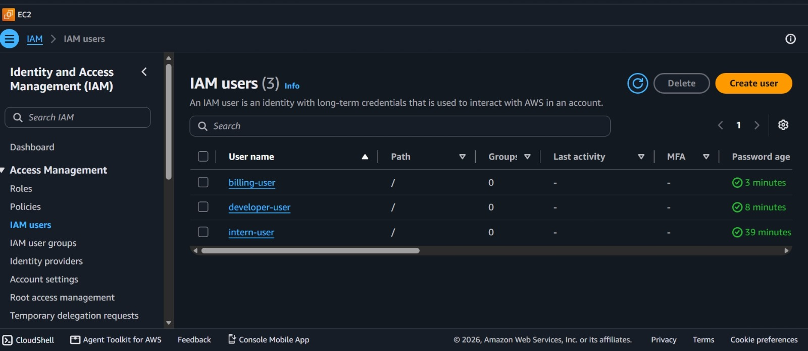
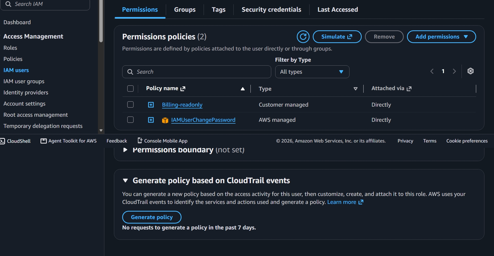
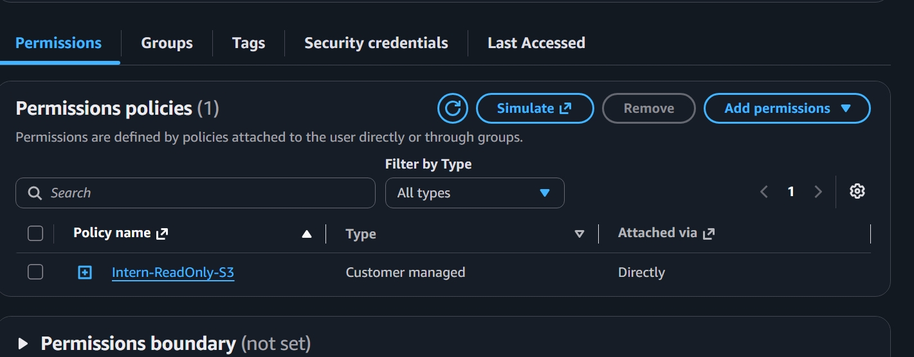
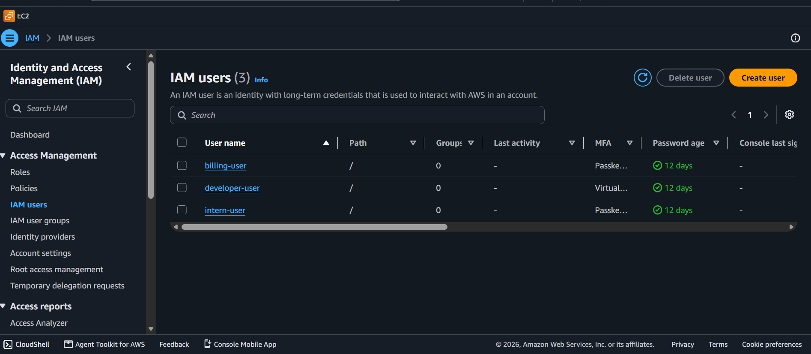

# iam-least-privilege-p2

## AWS IAM Least-Privilege + MFA Enforcement

**Problem:** Everyone had admin access = security risk.

**Solution:** 3 custom least-privilege policies with Explicit DENY + MFA enforced.

### Users & Policies
- **billing-user** → Billing ReadOnly (View billing only, Deny EC2/S3/IAM)
- **developer-user** → EC2 Limited (us-east-1 only, Deny IAM/Billing)
- **intern-user** → S3 ReadOnly (List/Get only, Deny Delete)

### Security Hardening
- MFA: 2x Passkey + 1x Virtual Authenticator
- Password Age: 12 days (compliant <90 days)
- No access keys

### Proof of Work
#### 1. IAM Users

#### 2. Billing Permission

#### 3. Developer Permission

#### 4. Intern Permission

#### 5. MFA Enforced - Final

